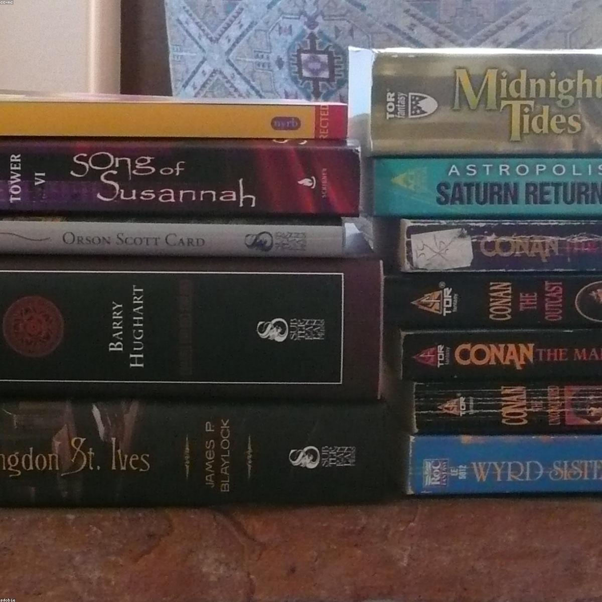

# Introductory Session {layout="title" data-gp-kicker="WORKSHOP / BAMBERG" data-gp-section="Opening"}

Workshop / Session 1

AI FOR RESEARCH

Foundations, limits, workflows

<!-- 

 -->

<!-- Imported into Quarto deck format from `ai_for_research_workshop_slides.md`. -->
<!-- Keep the draft file in place for continued work on comments and source notes. -->

# About Me {layout="bullets"}

* Max Noichl, doctoral candidate in theoretical philosophy at Utrecht University.
* Philosophy of machine learning. [OPEN](#){.opens-modal data-modal-type="iframe" data-modal-url="images/2508.15929v1.pdf"}
* Data-driven methods for philosophy.
* Computational Metaphilosophy [OPEN](#){.opens-modal data-modal-type="iframe" data-modal-url="images/Reason___Intuition.pdf"}
* OpenAlex Mapper [OPEN](#){.opens-modal data-modal-type="iframe" data-modal-url="https://maxnoichl-openalex-mapper.hf.space"}
<!-- * Scientific Model Transfer [OPEN](#){.opens-modal data-modal-type="iframe" data-modal-url="images/model_transfer.pdf"} -->
* Simulations for social epistemology.
* Doing philosophy with AI.

# Overview {layout="outline" data-gp-kicker="Workshop / Overview" data-gp-section="Plan"}

* This is the first of three connected workshop sessions across March 18 and 19, 2026.
* Session 1 covers LLM foundations, limits, audio, OCR, and practical research workflows.
* Session 2 and Session 3 now live in separate deck files for continued drafting.
* The workshop website bundles the landing page, slides, and notebook in one place.

# Schedule {layout="table" data-gp-kicker="Agenda / 01" data-gp-section="Plan"}

| Day | Time | Session | Focus |
|---|---|---|---|
| Wed, March 18, 2026 | 14:00-16:30 | Introductory Session | Overview of useful AI tools for research work |
| Thu, March 19, 2026 | 09:30-12:00 | Text Analysis | Structuring, analyzing, and interpreting texts with AI support |
| Thu, March 19, 2026 | 13:00-15:30 | Programming | Prompting, debugging, and notebook-based coding with AI support |

# Preparation {layout="half" data-gp-kicker="Setup / 02" data-gp-section="Plan"}

:::: {.columns .gp-two-col .gp-two-col--qr}
::: {.column width="62%"}

* Website: [https://mnoichl.github.io/workshop_AI_bamberg/](https://mnoichl.github.io/workshop_AI_bamberg/)
* For text analysis: Google-account for access to Colab.
* For introductiong & AI-assissted programming: Subscription to Chat-GPT or Claude

:::
::: {.column width="38%"}

::: {.gp-figure .gp-figure--qr}
<iframe class="gp-qr-embed" src="qrcode.html?url=https%3A%2F%2Fmnoichl.github.io%2Fworkshop_AI_bamberg%2F" title="QR code to workshop website"></iframe>
:::

:::
::::

<!-- 
# Introductory Session: AI for Research {layout="divider" data-gp-kicker="Session 1 / Wed, March 18" data-gp-section="Session 1"}

Foundations, limits, workflows -->

# Plan: AI for Research {layout="bullets" data-gp-kicker="Session 1 / Scope" data-gp-section="Session 1"}
* AI = mainly LLMs (for today)
* How do LLMs work?
* How to think about them?
* Econ & Ethics
* *10 Minute Break*
* Usage for research.
* Usage for actual science.

# How do LLMs work I {layout="bullets" data-gp-kicker="Session 1 / Foundations" data-gp-section="Session 1"}

* How to teach a computer language?
* Idea 1: Just enumerate all the words (BOW-Models, topic models)
* But: Words have meaning!
* Idea 2: Use word vectors (E.g. Word2Vec)
* But: Grammar!
* Idea 3: Split words into tokens (E.g. fastText)

# How do LLMs work II {layout="bullets" data-gp-kicker="Session 1 / Foundations" data-gp-section="Session 1"}

* But: Meaning is contextual! And we want to produce language! [OPEN PAPER](#){.opens-modal data-modal-type="iframe" data-modal-url="https://arxiv.org/pdf/1706.03762.pdf"}
* Idea 4: Use a Generative Transformer model [OPEN](#){.opens-modal data-modal-type="iframe" data-modal-url="https://poloclub.github.io/transformer-explainer/"}
<!-- * But: This isn't very smart?
* Idea 5: Train on *everything.*  -->
* But: This is awful!
* Idea 5: Use reinforcement learning from Human Feedback (RLHF)

# Perspectives on LLMs {layout="half" .gp-perspectives data-gp-fragments="off" data-gp-kicker="Session 1 / Lenses" data-gp-section="Session 1"}

:::: {.columns .gp-two-col .gp-two-col--perspectives}
::: {.column width="48%"}

::: {.fragment .gp-perspectives-item data-fragment-index="0"}
LLMs are **"stochastic parrots"**/autocomplete systems.
:::

[OPEN PDF](#){.fragment .opens-modal .gp-perspectives-link data-fragment-index="1" data-modal-type="iframe" data-modal-url="https://upload.wikimedia.org/wikipedia/commons/f/f2/On_the_Dangers_of_Stochastic_Parrots_Can_Language_Models_Be_Too_Big.pdf"}

::: {.fragment .gp-perspectives-item data-fragment-index="2"}
But: Predicting the next token is *hard* ("the culprit is ___")
:::

::: {.fragment .gp-perspectives-item data-fragment-index="3"}
LLMs as **lossy compression**.
:::

::: {.fragment .gp-perspectives-item data-fragment-index="4"}
LLMs as **shoggoths**: polished interfaces over something opaque, alien, and difficult to align. [OPEN IMAGE](#){.opens-modal data-modal-type="image" data-modal-url="images/shoggoth_classic.jpeg"}
:::

:::
::: {.column width="52%"}

::: {.gp-perspectives-visual}
::: {.fragment .fade-in .gp-perspectives-panel data-fragment-index="0"}
::: {.gp-perspectives-frame}
::: {.gp-media .gp-halftone data-gp-halftone="cmyk" data-gp-preset="newspaper"}
{.gp-frame-img .gp-img-tone-bw alt="Close portrait of a parrot"}
:::
:::
:::

::: {.fragment .fade-in .gp-perspectives-panel data-fragment-index="2"}
::: {.gp-perspectives-frame}
::: {.gp-media .gp-halftone data-gp-halftone="cmyk" data-gp-preset="newspaper"}
{.gp-frame-img .gp-img-tone-bw alt="Detective scene around a table"}
:::
:::
:::

::: {.fragment .fade-in .gp-perspectives-panel data-fragment-index="3"}
::: {.gp-perspectives-frame}
::: {.gp-media .gp-halftone data-gp-halftone="cmyk" data-gp-preset="newspaper"}
{.gp-frame-img .gp-img-tone-bw alt="Tight stack of books as compression metaphor"}
:::
:::
:::

::: {.fragment .fade-in .gp-perspectives-panel data-fragment-index="4"}
::: {.gp-perspectives-frame}
::: {.gp-media .gp-halftone data-gp-halftone="cmyk" data-gp-preset="newspaper"}
{.gp-frame-img .gp-img-tone-bw alt="Underwater octopus as shoggoth metaphor"}
:::
:::
:::
:::

:::
::::

# Terminology {layout="bullets" data-gp-kicker="Session 1 / Vocabulary" data-gp-section="Session 1"}

* **Architectures**: GPT (Generative Pretraining Transformer), BERT (Bidirectional Encoder Representations from Transformers), etc.
* **Companies**: OpenAI, Anthropic, Google, NVIDIA, Mistral, DeepSeek, Meta, Alibaba, etc.
* **Specific Models/families**: GPT-4o, GPT-5.4, o1, o3;  Claude Haiku, Sonnet, Opus; Gemini & nano-banana; etc.
* **Open/local model families**: Llama, Mistral, DeepSeek, Qwen, Kimi, gpt-oss....
* **Products**: ChatGPT, Claude Code, Perplexity, Gemini, etc.

# How smart are they? I {layout="bullets" data-gp-kicker="Session 1 / Limits" data-gp-section="Session 1"}

* They can solve difficult tasks and still fail on surprisingly small ones.
* Exercise: How many r's in "strawberry"? [OPEN IMAGE](#){.opens-modal data-modal-type="image" data-modal-url="images/strawberry.png"}
* Problem: Tokenization.
* Car-wash problem. [OPEN IMAGE](#){.opens-modal data-modal-type="image" data-modal-url="images/carwash.png"}
* Problem: Conversational context.
* Note: These things get hot-fixed!

# How smart are they? II {layout="bullets" data-gp-kicker="Session 1 / Limits" data-gp-section="Session 1"}

* Hallucinations.
* ARC-style benchmarks try to test abstract reasoning on tasks that are easy for humans but hard for AI.
* The capability frontier is **jagged**: performance is uneven across neighboring tasks. [OPEN IMAGE](#){.opens-modal data-modal-type="image" data-modal-url="images/capability_frontier.jpeg"}
* But maybe that's the case for humans too?

# Extending LLMs {layout="bullets" data-gp-kicker="Session 1 / Systems" data-gp-section="Session 1"}

* **Retrieval-augmented generation (RAG)** adds material to context via search.
* **Reasoning models:** generate tokens before answering (test-time compute) [OPEN](#){.opens-modal data-modal-type="image" data-modal-url="images/test_time_compute.png"}
* **Agents:** combine models with tools, memory, state, and a control loop.
* **Harness**: retries, permissions, logging, cost control.
*  **Command line use:** token efficient search, shell scripting etc.

# Ethics & Economics {.gp-section-slide data-gp-section="Session 1"}

# Economics {layout="bullets" data-gp-kicker="Session 1 / Stakes" data-gp-section="Session 1"}

* Compute is expensive!
* You get (maybe more than) what you pay for!
* Self-hosting does not work near the frontier, but for specialized tasks.
* Academic/European infrastructure has not caught up yet.

# Ethics {layout="bullets" data-gp-kicker="Session 1 / Stakes" data-gp-section="Session 1"}

* *So many problems!*
* Big, energy intensive, somewhat water-wasteful industry.
* Probably not worse than everything else we do, but doesn't help either...
* Copyright & Commons
* Many specific issues: Labour displacement, data ethics, decision-making, etc.

# AI in Practice {.gp-section-slide data-gp-section="Session 1"}

# General considerations {layout="bullets" data-gp-kicker="Session 1 / Research Use" data-gp-section="Session 1"}

* Prompt-engineering is over. 
* But context matters a lot: Give it as much information as possible about what you want. 
* Try, evaluate, iterate. 
* Options to play with later GPT 5.4 Pro (slow), Claude Opus 4.6 (fast), GPT-oss (local & open), Gemini, Kimi & Grok (via cursor)

# AI detection {layout="bullets" data-gp-kicker="Session 1 / Research Use" data-gp-section="Session 1"}

* First-generation AI detectors were **very bad**.
* Current SOTA detectors are **somewhat better** (E. g. [Pangram](https://pangram.com/)). [OPEN LIVE TOOL](#){.opens-modal data-modal-type="iframe" data-modal-url="https://maxnoichl-pangram-api-tester.hf.space"}
* But still **unreliable enough** considering inductive risk!
* **Exercise**: Ask your LLM a question & find tells. [OPEN SCREENSHOT](#){.opens-modal data-modal-type="image" data-modal-url="images/Screenshot_detection.png"}
* "It's not only X it's Y", "In practice....", "---"
* **Exercise**: Can we fool Pangram?

# Models as reviewers {layout="bullets" data-gp-kicker="Session 1 / Workflows" data-gp-section="Session 1"}

* Proofreading. [OPEN SCREENSHOT](#){.opens-modal data-modal-type="image" data-modal-url="images/Proofread.png"}
* Due to the "model-smell" I avoid autonomous rewrite. 
* But: Prompt for a list of edits, than pick the ones I want works well.
* Exercise: Review a draft or paper.  NOTE Different harshness? 
* Looking for the *mot juste*
* Fixing emails (also emotionally). [OPEN SCREENSHOT](#){.opens-modal data-modal-type="image" data-modal-url="images/christophe_email.png"}

# Models as reviewers II {layout="bullets" data-gp-kicker="Session 1 / Workflows" data-gp-section="Session 1"}

* Heuristic review of code, maths  & statistics.
* Ask: Find the crucial error!
* Sometimes surprising things turn up.
* Maybe a future in review pipelines. PUT EXAMPLE?

# Data annotation {layout="bullets" data-gp-kicker="Session 1 / Workflows" data-gp-section="Session 1"}

* Annotation and extraction are often the easiest high-value research uses.
* Give the model a schema, examples, and a concrete output format.
* Validate on a hand-checked sample before scaling up.
* Exercise: politician extraction + tone scoring. [OPEN TEXT](#){.opens-modal data-modal-type="html" data-modal-url="media/data-annotation-exercise.html"}

# Models for inquiry  {layout="bullets" data-gp-kicker="Session 1 / Workflows" data-gp-section="Session 1"}

* Autonomous research like **Deep Research** can be very helpful.
* Limited by open access (e.g. very good for computer science.)
* Enrich citations (which citations am I missing?)
* Exercise: Run a deep-research on a topic you know, and on one you don't. 

# Models for coding {layout="bullets" data-gp-kicker="Session 1 / Workflows" data-gp-section="Session 1"}

* A lot of science is amateur software development.
* It's often easy to improve our code.
* Throw-away websites.
* More & better visualizations.
* Better documentation & reproducibility.
* Iterate faster, but beware technical debt.
* *More tomorrow...*

# Speech to text: Whisper and NVIDIA {layout="bullets" data-gp-kicker="Session 1 / Audio" data-gp-section="Session 1"}

* Speech-to-text is a (basically) solved problem.
* Live demo scratchpad: [OPEN TRANSCRIPT PAD](#){.opens-modal data-modal-type="iframe" data-modal-url="media/live-transcript-demo.html"}
* Model reccommendations: Big models in the Whisper-family & NVIDIA Parakeet
* Transcribe interviews, lectures, talks. Talk to the computer.
* Transcribe, then cleanup with a strong LLM + prompt.
* Only problem: Context.

# Vision / OCR models {layout="bullets" data-gp-kicker="Session 1 / Images and PDFs" data-gp-section="Session 1"}

* Most LLMs today are actually vision-language models.
* Sketch-to-graphic workflows (e.g. Nano-Banana 2, ChatGPT, etc. ) [SKETCH](#){.opens-modal data-modal-type="image" data-modal-url="images/manual_Sketch#.jpeg"} [CLEANED](#){.opens-modal data-modal-type="image" data-modal-url="images/cleaned_up_sketch.jpeg"}.
* Diagram to SVG/LaTeX, then fix manually.
* VLM based OCR models (e.g. OLM OCR, Chandra, etc. ) easily beat old-school.

<!-- * Typical failure modes: multi-column layouts, handwriting, formulas, low-quality scans, and hallucinated table structure. -->

# AI for science {.gp-section-slide data-gp-section="Session 1"}

# Usage as scientists {layout="bullets" data-gp-kicker="Session 1 / Research Practice" data-gp-section="Session 1"}

* LLMs can do data-labelling on complex categories.
* Structured generation!
* Serial queries are necessary: LLMs are lazy.
* Validate inter-rater agreement LLM & human, then scale up. 
* Usage via APIs or locally for sensitive data.
* Set spending limits & alerts!

<!-- 
* Data labeling is already a real research use case when you provide a codebook, examples, and a clear output schema.
* Spot-check aggressively: good label accuracy does not automatically imply valid downstream inference.
* Research use improves a lot once you move beyond the chat box and into APIs, scripts, and reproducible workflows.
* Set spending limits, alerts, rate limits, and kill switches before students or collaborators experiment at scale.
* A practical scientist workflow is:
  - prototype in chat
  - stabilize in scripts
  - evaluate on held-out examples
  - add human review where mistakes are costly
  - document prompts, model versions, and failure cases -->

# Practical closing slide {layout="bullets" data-gp-kicker="Session 1 / Takeaways" data-gp-section="Session 1"}

* LLMs are best understood as powerful, uneven, tool-using probabilistic systems.
* Use them aggressively for drafts, checks, coding help, and labeling.
* Use them cautiously for claims, citations, and conclusions.
* Keep a human in the loop where error costs are high.
* The real questions are what they are good at, what kinds of errors they make, and how to build workflows that make those errors visible and manageable.

# Materials {layout="bullets" data-gp-kicker="Links / 03" data-gp-section="Material"}

* Website: [Workshop overview](../)
* Slides: [Introductory session deck](../slides/)
* Notebook: [Open in Colab](https://colab.research.google.com/github/MNoichl/workshop_AI_bamberg/blob/main/notebooks/workshop_notebook.ipynb)

# Room and contact {layout="bullets" data-gp-kicker="Info / 04" data-gp-section="Material"}

* Instructor: Max Noichl
* Room: likely BAGSS seminar room
* Version date: March 17, 2026
